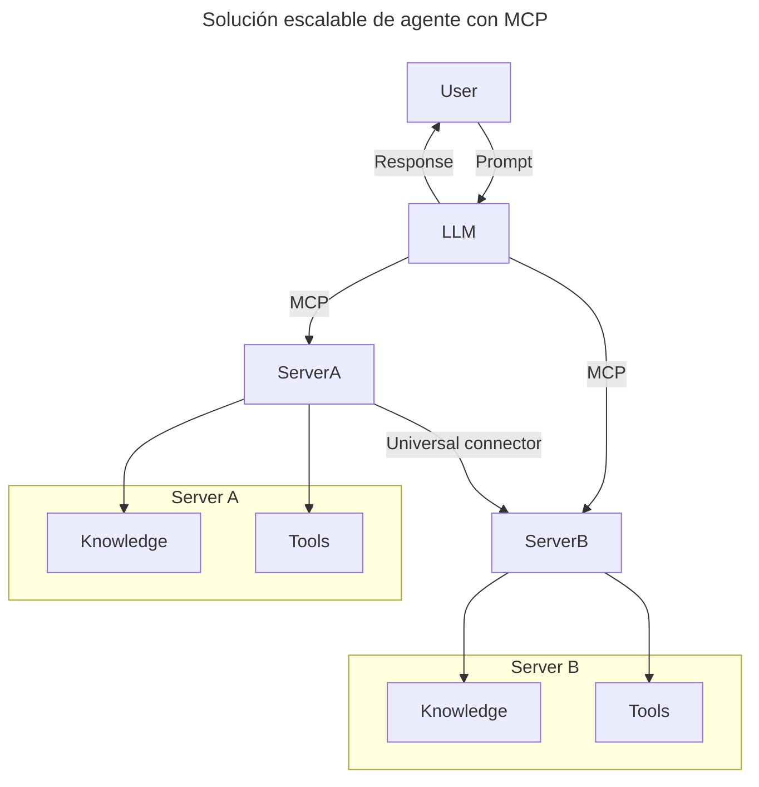
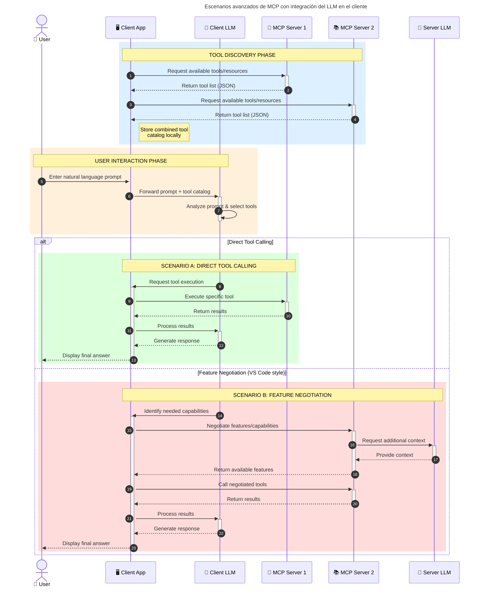

# Introducción al Protocolo de Contexto de Modelo (MCP): Por qué es importante para aplicaciones de IA escalables

_(Haz clic en la imagen de arriba para ver el video de esta lección)_

Las aplicaciones de IA generativa son un gran avance, ya que a menudo permiten que el usuario interactúe con la aplicación utilizando indicaciones en lenguaje natural. Sin embargo, a medida que se invierte más tiempo y recursos en dichas aplicaciones, es importante asegurarse de que se puedan integrar funcionalidades y recursos de manera sencilla, que la aplicación pueda manejar más de un modelo y gestionar diversas complejidades de los modelos. En resumen, construir aplicaciones de IA generativa es fácil al principio, pero a medida que crecen y se vuelven más complejas, es necesario definir una arquitectura y probablemente depender de un estándar para garantizar que las aplicaciones se construyan de manera consistente. Aquí es donde entra MCP para organizar las cosas y proporcionar un estándar.

---

## **🔍 ¿Qué es el Protocolo de Contexto de Modelo (MCP)?**

El **Protocolo de Contexto de Modelo (MCP)** es una **interfaz abierta y estandarizada** que permite que los Modelos de Lenguaje Extenso (LLMs) interactúen sin problemas con herramientas externas, APIs y fuentes de datos. Proporciona una arquitectura consistente para mejorar la funcionalidad de los modelos de IA más allá de sus datos de entrenamiento, permitiendo sistemas de IA más inteligentes, escalables y receptivos.

---

## **🎯 Por qué la estandarización en IA es importante**

A medida que las aplicaciones de IA generativa se vuelven más complejas, es esencial adoptar estándares que aseguren **escalabilidad, extensibilidad, mantenibilidad** y **eviten el bloqueo de proveedores**. MCP aborda estas necesidades mediante:

- La unificación de las integraciones modelo-herramienta
- La reducción de soluciones personalizadas frágiles
- Permitir que múltiples modelos de diferentes proveedores coexistan dentro de un mismo ecosistema

**Nota:** Aunque MCP se presenta como un estándar abierto, no hay planes para estandarizar MCP a través de organismos de estándares existentes como IEEE, IETF, W3C, ISO u otros.

---

## **📚 Objetivos de aprendizaje**

Al final de este artículo, podrás:

- Definir el **Protocolo de Contexto de Modelo (MCP)** y sus casos de uso
- Comprender cómo MCP estandariza la comunicación entre modelos y herramientas
- Identificar los componentes principales de la arquitectura MCP
- Explorar aplicaciones reales de MCP en contextos empresariales y de desarrollo

---

## **💡 Por qué el Protocolo de Contexto de Modelo (MCP) es revolucionario**

### **🔗 MCP resuelve la fragmentación en las interacciones de IA**

Antes de MCP, integrar modelos con herramientas requería:

- Código personalizado para cada par herramienta-modelo
- APIs no estandarizadas para cada proveedor
- Fallos frecuentes debido a actualizaciones
- Escalabilidad limitada con más herramientas

### **✅ Beneficios de la estandarización MCP**

| **Beneficio**              | **Descripción**                                                                |
|--------------------------|--------------------------------------------------------------------------------|
| Interoperabilidad         | Los LLMs funcionan sin problemas con herramientas de diferentes proveedores    |
| Consistencia              | Comportamiento uniforme en plataformas y herramientas                         |
| Reutilización             | Herramientas construidas una vez pueden usarse en múltiples proyectos y sistemas |
| Desarrollo acelerado      | Reducción del tiempo de desarrollo mediante interfaces estándar plug-and-play  |

---

## **🧱 Descripción general de la arquitectura de MCP**

MCP sigue un **modelo cliente-servidor**, donde:

- **Hosts MCP** ejecutan los modelos de IA
- **Clientes MCP** inician solicitudes
- **Servidores MCP** proporcionan contexto, herramientas y capacidades

### **Componentes clave:**

- **Recursos** – Datos estáticos o dinámicos para los modelos  
- **Prompts** – Flujos de trabajo predefinidos para generación guiada  
- **Herramientas** – Funciones ejecutables como búsqueda, cálculos  
- **Muestreo** – Comportamiento agente mediante interacciones recursivas
- **Elicitación** – Solicitudes iniciadas por el servidor para entrada del usuario
- **Raíces** – Límites del sistema de archivos para el control de acceso del servidor

### **Arquitectura del protocolo:**

MCP utiliza una arquitectura de dos capas:
- **Capa de datos**: Comunicación basada en JSON-RPC 2.0 con gestión del ciclo de vida y primitivas
- **Capa de transporte**: Comunicación STDIO (local) y HTTP con SSE (remota)

---

## Cómo funcionan los servidores MCP

Los servidores MCP operan de la siguiente manera:

- **Flujo de solicitudes**:
    1. Un usuario final o software actúa en su nombre para iniciar una solicitud.
    2. El **Cliente MCP** envía la solicitud a un **Host MCP**, que gestiona el tiempo de ejecución del modelo de IA.
    3. El **Modelo de IA** recibe el prompt del usuario y puede solicitar acceso a herramientas o datos externos mediante una o más llamadas a herramientas.
    4. El **Host MCP**, no el modelo directamente, se comunica con los **Servidores MCP** apropiados utilizando el protocolo estandarizado.
- **Funcionalidad del Host MCP**:
    - **Registro de herramientas**: Mantiene un catálogo de herramientas disponibles y sus capacidades.
    - **Autenticación**: Verifica permisos para el acceso a herramientas.
    - **Manejador de solicitudes**: Procesa solicitudes de herramientas entrantes desde el modelo.
    - **Formateador de respuestas**: Estructura las salidas de herramientas en un formato que el modelo pueda entender.
- **Ejecución del servidor MCP**:
    - El **Host MCP** enruta las llamadas a herramientas a uno o más **Servidores MCP**, cada uno exponiendo funciones especializadas (por ejemplo, búsqueda, cálculos, consultas de bases de datos).
    - Los **Servidores MCP** realizan sus respectivas operaciones y devuelven resultados al **Host MCP** en un formato consistente.
    - El **Host MCP** formatea y retransmite estos resultados al **Modelo de IA**.
- **Finalización de la respuesta**:
    - El **Modelo de IA** incorpora las salidas de herramientas en una respuesta final.
    - El **Host MCP** envía esta respuesta de vuelta al **Cliente MCP**, que la entrega al usuario final o al software que la llamó.

```mermaid
---
title: Arquitectura e interacciones de componentes MCP
description: Un diagrama que muestra los flujos de los componentes en MCP.
---
graph TD
    Cliente[Cliente MCP/Aplicación] -->|Envía solicitud| H[Host MCP]
    H -->|Invoca| A[Modelo de IA]
    A -->|Solicitud de herramienta| H
    H -->|Protocolo MCP| T1[Herramienta Servidor MCP 01: Búsqueda web]
    H -->|Protocolo MCP| T2[Herramienta Servidor MCP 02: Herramienta de cálculo]
    H -->|Protocolo MCP| T3[Herramienta Servidor MCP 03: Acceso a base de datos]
    H -->|Protocolo MCP| T4[Herramienta Servidor MCP 04: Herramienta de sistema de archivos]
    H -->|Envía respuesta| Cliente

    subgraph "Componentes del Host MCP"
        H
        G[Registro de herramientas]
        I[Autenticación]
        J[Manejador de solicitudes]
        K[Formateador de respuestas]
    end

    H <--> G
    H <--> I
    H <--> J
    H <--> K

    style A fill:#f9d5e5,stroke:#333,stroke-width:2px
    style H fill:#eeeeee,stroke:#333,stroke-width:2px
    style Cliente fill:#d5e8f9,stroke:#333,stroke-width:2px
    style G fill:#fffbe6,stroke:#333,stroke-width:1px
    style I fill:#fffbe6,stroke:#333,stroke-width:1px
    style J fill:#fffbe6,stroke:#333,stroke-width:1px
    style K fill:#fffbe6,stroke:#333,stroke-width:1px
    style T1 fill:#c2f0c2,stroke:#333,stroke-width:1px
    style T2 fill:#c2f0c2,stroke:#333,stroke-width:1px
    style T3 fill:#c2f0c2,stroke:#333,stroke-width:1px
    style T4 fill:#c2f0c2,stroke:#333,stroke-width:1px
```

## 👨‍💻 Cómo construir un servidor MCP (con ejemplos)

Los servidores MCP permiten extender las capacidades de los modelos de IA proporcionando datos y funcionalidad. 

¿Listo para probarlo? Aquí tienes SDKs específicos de lenguaje y/o pila con ejemplos de crear servidores MCP simples en diferentes lenguajes/pilas:

- **Python SDK**: https://github.com/modelcontextprotocol/python-sdk

- **TypeScript SDK**: https://github.com/modelcontextprotocol/typescript-sdk

- **Java SDK**: https://github.com/modelcontextprotocol/java-sdk

- **C#/.NET SDK**: https://github.com/modelcontextprotocol/csharp-sdk

## 🌍 Casos reales del mundo real para MCP

MCP habilita una amplia gama de aplicaciones al extender las capacidades de IA:

| **Aplicación**              | **Descripción**                                                                |
|------------------------------|--------------------------------------------------------------------------------|
| Integración de datos empresariales  | Conecta LLMs a bases de datos, CRMs o herramientas internas                             |
| Sistemas de IA agente           | Habilita agentes autónomos con acceso a herramientas y flujos de trabajo de decisión        |
| Aplicaciones multimodales     | Combina textos, imágenes y audio herramientas dentro de una única app de IA            |
| Integración de datos en tiempo real   | Trae datos en tiempo real en las interacciones de IA para respuestas más precisas y actuales        |

### 🧠 MCP = Estándar universal para interacciones de IA

El Protocolo de Contexto de Modelo (MCP) actúa como un estándar universal para interacciones de IA, mucho como cómo USB-C estandarizó las conexiones físicas para dispositivos. En el mundo de la IA, MCP proporciona una interfaz consistente, permitiendo que los modelos (clientes) se integren sin problemas con herramientas y proveedores de datos externos (servidores). Esto elimina la necesidad de protocolos diversos y personalizados para cada API o fuente de datos.

Bajo MCP, un servidor MCP-compatible (referred to as an MCP server) sigue un estándar unificado. Estos servidores pueden listar las herramientas o acciones que ofrecen y ejecutar esas acciones cuando sean solicitadas por un agente de IA. Las plataformas de agentes de IA que soporten MCP son capaces de descubrir herramientas disponibles desde los servidores y de invocarlas mediante este protocolo estandarizado.

### 💡 Facilita el acceso al conocimiento

Más allá de ofrecer herramientas, MCP también facilita el acceso al conocimiento. Permite que las aplicaciones proporcionen contexto a los modelos de lenguaje de gran tamaño (LLMs) al vincularlos a diversas fuentes de datos. Por ejemplo, un servidor MCP podría representar un repositorio de documentos de una empresa, permitiendo que los agentes recuperen información relevante en demanda. Otra server podría manejar acciones específicas como enviar correos o actualizar registros. Desde la perspectiva del agente, estas son simplemente herramientas que puede usar—algunas herramientas devuelven datos (contexto de conocimiento), mientras que otras realizan acciones. MCP gestiona eficientemente ambos.

Un agente conectado a un servidor MCP automáticamente aprende las capacidades disponibles y los datos accesibles del servidor mediante un formato estándar. Esta estandarización permite la disponibilidad dinámica de herramientas. Por ejemplo, agregar un nuevo servidor MCP a un sistema de un agente hace que sus funciones sean inmediatamente usables sin necesidad de personalizar más las instrucciones del agente.

Este integración fluida se alinea con el flujo representado en el siguiente diagrama, donde los servidores proporcionan tanto herramientas como conocimiento, asegurando una colaboración sin problemas entre sistemas. 

### 👉 Ejemplo: Solución escalable de agente

El Universal Connector permite que los servidores MCP se comuniquen y comparta capacidades con cada uno, permitiendo que ServerA delegue tareas a ServerB o acceda a sus herramientas y conocimiento. Esto federiza herramientas y datos entre servidores, apoyando arquitecturas escalables y modulares de agentes. Porque MCP estandariza la exposición de herramientas, los agentes pueden descubrir y rutear solicitudes entre servidores sin integraciones codificadas.

**Federación de herramientas y conocimiento**: Las herramientas y datos pueden ser accedidos entre servidores, permitiendo una arquitectura más escalable y modular de agentes.

### 🔄 Escenarios avanzados de MCP con integración del LLM en el cliente

Más allá de la arquitectura básica MCP, hay escenarios avanzados donde tanto el cliente como el servidor contienen LLMs, permitiendo interacciones más sofisticadas. En el siguiente diagrama, **Client App** podría ser una IDE con un número de herramientas MCP disponibles para el usuario por el LLM:

## 🔐 Beneficios prácticos de MCP

Aquí tienes los beneficios prácticos de usar MCP:

- **Freshness**: Los modelos pueden acceder a información actualizada más allá de sus datos de entrenamiento
- **Capability Extension**: Los modelos pueden aprovechar herramientas especializadas para tareas que no fueron entrenadas
- **Reduced Hallucinations**: Las fuentes de datos externas proporcionan un fundamento factual
- **Privacy**: Los datos sensibles pueden permanecer dentro de entornos seguros en lugar de estar embebidos en prompts

## 📌 Claves para usar MCP

Aquí tienes las claves para usar MCP:

- **MCP** estandariza cómo los modelos de IA interactúan con herramientas y datos
- Promueve **extensibilidad, consistencia y interoperabilidad**
- MCP ayuda a **reducir el tiempo de desarrollo, mejorar la fiabilidad y extender las capacidades de los modelos**
- La arquitectura cliente-servidor **permite aplicaciones de IA flexibles y escalables**

## 🧠 Ejercicio

Piensa en una aplicación de IA que te interese construir.

- ¿Cuáles **herramientas o datos externos** podrían mejorar sus capacidades?
- ¿Cómo podría MCP hacer la integración **más sencilla y más confiable?**

## Recursos adicionales

- [Repositorio MCP GitHub](https://github.com/modelcontextprotocol)

## Qué viene después

Siguiente: [Capítulo 1: Conceptos básicos](../01-CoreConcepts/README.md)
