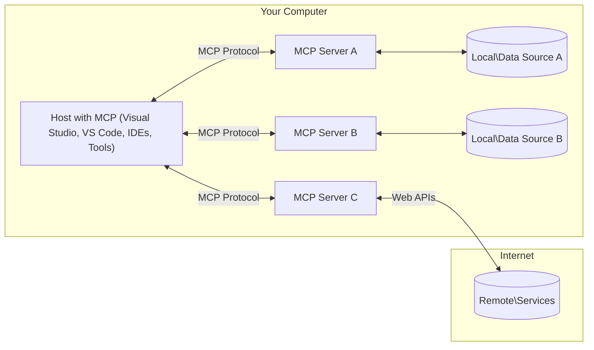

# Conceptos Fundamentales de MCP: Dominando el Protocolo de Contexto de Modelo para la Integración de IA

[](https://youtu.be/earDzWGtE84)

_(Haz clic en la imagen de arriba para ver el video de esta lección)_

El [Model Context Protocol (MCP)](https://github.com/modelcontextprotocol) es un framework estandarizado y potente que optimiza la comunicación entre Modelos de Lenguaje Grande (LLMs) y herramientas externas, aplicaciones y fuentes de datos.
Esta guía te llevará a través de los conceptos fundamentales de MCP. Aprenderás sobre su arquitectura cliente-servidor, componentes esenciales, mecánica de comunicación y mejores prácticas de implementación.

- **Consentimiento Explícito del Usuario**: Todo acceso a datos y operaciones requiere aprobación explícita del usuario antes de su ejecución. Los usuarios deben entender claramente qué datos serán accedidos y qué acciones se realizarán, con control granular sobre permisos y autorizaciones.

- **Protección de la Privacidad de Datos**: Los datos del usuario solo se exponen con consentimiento explícito y deben estar protegidos por controles de acceso robustos durante todo el ciclo de vida de la interacción. Las implementaciones deben prevenir la transmisión no autorizada de datos y mantener límites estrictos de privacidad.

- **Seguridad en la Ejecución de Herramientas**: Cada invocación de herramienta requiere consentimiento explícito del usuario con comprensión clara de la funcionalidad, parámetros e impacto potencial de la herramienta. Deben existir límites de seguridad robustos para prevenir la ejecución involuntaria, insegura o maliciosa de herramientas.

- **Seguridad en la Capa de Transporte**: Todos los canales de comunicación deben usar mecanismos apropiados de cifrado y autenticación. Las conexiones remotas deben implementar protocolos de transporte seguros y una gestión adecuada de credenciales.

#### Directrices de Implementación:

- **Gestión de Permisos**: Implementar sistemas de permisos detallados que permitan a los usuarios controlar qué servidores, herramientas y recursos son accesibles
- **Autenticación y Autorización**: Usar métodos de autenticación seguros (OAuth, claves API) con gestión adecuada de tokens y vencimiento
- **Validación de Entradas**: Validar todos los parámetros y entradas de datos según los esquemas definidos para prevenir ataques de inyección
- **Registro de Auditoría**: Mantener registros completos de todas las operaciones para monitoreo de seguridad y cumplimiento

## Descripción General

Esta lección explora la arquitectura fundamental y los componentes que conforman el ecosistema del Model Context Protocol (MCP). Aprenderás sobre la arquitectura cliente-servidor, los componentes clave y los mecanismos de comunicación que potencian las interacciones de MCP.

## Objetivos de Aprendizaje Clave

Al finalizar esta lección, podrás:

- Comprender la arquitectura cliente-servidor de MCP.
- Identificar los roles y responsabilidades de Hosts, Clientes y Servidores.
- Analizar las características principales que hacen de MCP una capa de integración flexible.
- Aprender cómo fluye la información dentro del ecosistema MCP.
- Obtener perspectivas prácticas a través de ejemplos de código en .NET, Java, Python y JavaScript.

## Arquitectura MCP: Una Mirada Más Profunda

El ecosistema MCP se construye sobre un modelo cliente-servidor. Esta estructura modular permite que las aplicaciones de IA interactúen con herramientas, bases de datos, APIs y recursos contextuales de manera eficiente. Analicemos esta arquitectura en sus componentes fundamentales.

En su núcleo, MCP sigue una arquitectura cliente-servidor donde una aplicación host puede conectarse a múltiples servidores:



- **MCP Hosts**: Programas como VSCode, Claude Desktop, IDEs o herramientas de IA que desean acceder a datos a través de MCP
- **MCP Clients**: Clientes de protocolo que mantienen conexiones 1:1 con servidores
- **MCP Servers**: Programas ligeros que exponen capacidades específicas a través del Model Context Protocol estandarizado
- **Local Data Sources**: Los archivos, bases de datos y servicios de tu computadora a los que los servidores MCP pueden acceder de forma segura
- **Remote Services**: Sistemas externos disponibles a través de internet a los que los servidores MCP pueden conectarse mediante APIs.

El Protocolo MCP es un estándar en evolución que utiliza versionado basado en fechas (formato YYYY-MM-DD). La versión actual del protocolo es **2025-11-25**. Puedes ver las últimas actualizaciones en la [especificación del protocolo](https://modelcontextprotocol.io/specification/2025-11-25/)

### 1. Hosts

En el Model Context Protocol (MCP), los **Hosts** son aplicaciones de IA que sirven como la interfaz principal a través de la cual los usuarios interactúan con el protocolo. Los Hosts coordinan y gestionan conexiones a múltiples servidores MCP creando clientes MCP dedicados para cada conexión de servidor. Ejemplos de Hosts incluyen:

- **Aplicaciones de IA**: Claude Desktop, Visual Studio Code, Claude Code
- **Entornos de Desarrollo**: IDEs y editores de código con integración MCP
- **Aplicaciones Personalizadas**: Agentes de IA y herramientas construidos con propósitos específicos

Los **Hosts** son aplicaciones que coordinan las interacciones con modelos de IA. Ellos:

- **Orquestan Modelos de IA**: Ejecutan o interactúan con LLMs para generar respuestas y coordinar flujos de trabajo de IA
- **Gestionan Conexiones de Clientes**: Crean y mantienen un cliente MCP por cada conexión de servidor MCP
- **Controlan la Interfaz de Usuario**: Gestionan el flujo de conversación, las interacciones del usuario y la presentación de respuestas
- **Aplican Seguridad**: Controlan permisos, restricciones de seguridad y autenticación
- **Gestionan el Consentimiento del Usuario**: Administran la aprobación del usuario para compartir datos y ejecutar herramientas


### 2. Clients

Los **Clients** son componentes esenciales que mantienen conexiones dedicadas uno a uno entre los Hosts y los servidores MCP. Cada cliente MCP es instanciado por el Host para conectarse a un servidor MCP específico, asegurando canales de comunicación organizados y seguros. Múltiples clientes permiten a los Hosts conectarse a múltiples servidores simultáneamente.

Los **Clients** son componentes conectores dentro de la aplicación host. Ellos:

- **Comunicación de Protocolo**: Envían solicitudes JSON-RPC 2.0 a servidores con prompts e instrucciones
- **Negociación de Capacidades**: Negocian características compatibles y versiones de protocolo con servidores durante la inicialización
- **Ejecución de Herramientas**: Gestionan solicitudes de ejecución de herramientas de los modelos y procesan respuestas
- **Actualizaciones en Tiempo Real**: Gestionan notificaciones y actualizaciones en tiempo real de los servidores
- **Procesamiento de Respuestas**: Procesan y formatean las respuestas del servidor para mostrarlas a los usuarios

### 3. Servers

Los **Servers** son programas que proporcionan contexto, herramientas y capacidades a los clientes MCP. Pueden ejecutarse localmente (en la misma máquina que el Host) o de forma remota (en plataformas externas), y son responsables de gestionar las solicitudes de los clientes y proporcionar respuestas estructuradas. Los Servers exponen funcionalidad específica a través del Model Context Protocol estandarizado.

Los **Servers** son servicios que proporcionan contexto y capacidades. Ellos:

- **Registro de Características**: Registran y exponen primitivas disponibles (recursos, prompts, herramientas) a los clientes
- **Procesamiento de Solicitudes**: Reciben y ejecutan llamadas a herramientas, solicitudes de recursos y solicitudes de prompts de los clientes
- **Provisión de Contexto**: Proporcionan información contextual y datos para mejorar las respuestas del modelo
- **Gestión de Estado**: Mantienen el estado de sesión y gestionan interacciones con estado cuando es necesario
- **Notificaciones en Tiempo Real**: Envían notificaciones sobre cambios de capacidades y actualizaciones a los clientes conectados

Los Servers pueden ser desarrollados por cualquier persona para extender las capacidades del modelo con funcionalidad especializada, y soportan escenarios de despliegue tanto local como remoto.

### 4. Server Primitives

Los Servers en el Model Context Protocol (MCP) proporcionan tres **primitivas** fundamentales que definen los bloques de construcción básicos para interacciones ricas entre clientes, hosts y modelos de lenguaje. Estas primitivas especifican los tipos de información contextual y acciones disponibles a través del protocolo.

Los servidores MCP pueden exponer cualquier combinación de las siguientes tres primitivas fundamentales:

#### Resources

Los **Resources** son fuentes de datos que proporcionan información contextual a las aplicaciones de IA. Representan contenido estático o dinámico que puede mejorar la comprensión y toma de decisiones del modelo:

- **Datos Contextuales**: Información estructurada y contexto para el consumo del modelo de IA
- **Bases de Conocimiento**: Repositorios de documentos, artículos, manuales y artículos de investigación
- **Fuentes de Datos Locales**: Archivos, bases de datos e información del sistema local
- **Datos Externos**: Respuestas de APIs, servicios web y datos de sistemas remotos
- **Contenido Dinámico**: Datos en tiempo real que se actualizan según condiciones externas

Los Resources se identifican por URIs y soportan descubrimiento a través de `resources/list` y recuperación a través de los métodos `resources/read`:

```text
file://documents/project-spec.md
database://production/users/schema
api://weather/current
```

#### Prompts

Los **Prompts** son plantillas reutilizables que ayudan a estructurar las interacciones con los modelos de lenguaje. Proporcionan patrones de interacción estandarizados y flujos de trabajo con plantillas:

- **Interacciones Basadas en Plantillas**: Mensajes pre-estructurados e iniciadores de conversación
- **Plantillas de Flujo de Trabajo**: Secuencias estandarizadas para tareas e interacciones comunes
- **Ejemplos Few-shot**: Plantillas basadas en ejemplos para la instrucción del modelo
- **Prompts del Sistema**: Prompts fundamentales que definen el comportamiento y contexto del modelo
- **Plantillas Dinámicas**: Prompts parametrizados que se adaptan a contextos específicos

Los Prompts soportan sustitución de variables y pueden ser descubiertos mediante `prompts/list` y recuperados con `prompts/get`:

```markdown
Generate a {{task_type}} for {{product}} targeting {{audience}} with the following requirements: {{requirements}}
```

#### Tools

Las **Tools** son funciones ejecutables que los modelos de IA pueden invocar para realizar acciones específicas. Representan los "verbos" del ecosistema MCP, permitiendo que los modelos interactúen con sistemas externos:

- **Funciones Ejecutables**: Operaciones discretas que los modelos pueden invocar con parámetros específicos
- **Integración con Sistemas Externos**: Llamadas a APIs, consultas a bases de datos, operaciones de archivos, cálculos
- **Identidad Única**: Cada herramienta tiene un nombre, descripción y esquema de parámetros distinto
- **E/S Estructurada**: Las herramientas aceptan parámetros validados y devuelven respuestas estructuradas y tipadas
- **Capacidades de Acción**: Permiten a los modelos realizar acciones en el mundo real y recuperar datos en vivo

Las Tools se definen con JSON Schema para la validación de parámetros y se descubren a través de `tools/list` y se ejecutan mediante `tools/call`. Las Tools también pueden incluir **iconos** como metadatos adicionales para una mejor presentación en la interfaz de usuario.

**Anotaciones de Herramientas**: Las Tools soportan anotaciones de comportamiento (p.ej., `readOnlyHint`, `destructiveHint`) que describen si una herramienta es de solo lectura o destructiva, ayudando a los clientes a tomar decisiones informadas sobre la ejecución de herramientas.

Ejemplo de definición de herramienta:

```typescript
server.tool(
  "search_products",
  {
    query: z.string().describe("Search query for products"),
    category: z.string().optional().describe("Product category filter"),
    max_results: z.number().default(10).describe("Maximum results to return")
  },
  async (params) => {
    // Execute search and return structured results
    return await productService.search(params);
  }
);
```

## Client Primitives

En el Model Context Protocol (MCP), los **clients** pueden exponer primitivas que permiten a los servidores solicitar capacidades adicionales de la aplicación host. Estas primitivas del lado del cliente permiten implementaciones de servidor más ricas e interactivas que pueden acceder a las capacidades del modelo de IA y a las interacciones del usuario.

### Sampling

El **Sampling** permite a los servidores solicitar completaciones del modelo de lenguaje de la aplicación de IA del cliente. Esta primitiva permite a los servidores acceder a las capacidades del LLM sin incorporar sus propias dependencias de modelo:

- **Acceso Independiente del Modelo**: Los servidores pueden solicitar completaciones sin incluir SDKs de LLM ni gestionar el acceso al modelo
- **IA Iniciada por el Servidor**: Permite a los servidores generar contenido de forma autónoma usando el modelo de IA del cliente
- **Interacciones LLM Recursivas**: Soporta escenarios complejos donde los servidores necesitan asistencia de IA para el procesamiento
- **Generación de Contenido Dinámico**: Permite a los servidores crear respuestas contextuales usando el modelo del host
- **Soporte de Llamadas a Herramientas**: Los servidores pueden incluir parámetros `tools` y `toolChoice` para permitir que el modelo del cliente invoque herramientas durante el muestreo

El Sampling se inicia a través del método `sampling/complete`, donde los servidores envían solicitudes de completación a los clientes.

### Roots

Los **Roots** proporcionan una forma estandarizada para que los clientes expongan los límites del sistema de archivos a los servidores, ayudando a los servidores a entender a qué directorios y archivos tienen acceso:

- **Límites del Sistema de Archivos**: Definen los límites donde los servidores pueden operar dentro del sistema de archivos
- **Control de Acceso**: Ayudan a los servidores a entender a qué directorios y archivos tienen permiso de acceder
- **Actualizaciones Dinámicas**: Los clientes pueden notificar a los servidores cuando la lista de roots cambia
- **Identificación Basada en URI**: Los Roots usan URIs `file://` para identificar directorios y archivos accesibles

Los Roots se descubren a través del método `roots/list`, con los clientes enviando `notifications/roots/list_changed` cuando los roots cambian.

### Elicitation

La **Elicitation** permite a los servidores solicitar información adicional o confirmación de los usuarios a través de la interfaz del cliente:

- **Solicitudes de Entrada del Usuario**: Los servidores pueden pedir información adicional cuando es necesaria para la ejecución de herramientas
- **Diálogos de Confirmación**: Solicitar aprobación del usuario para operaciones sensibles o de alto impacto
- **Flujos de Trabajo Interactivos**: Permitir a los servidores crear interacciones paso a paso con el usuario
- **Recopilación Dinámica de Parámetros**: Reunir parámetros faltantes u opcionales durante la ejecución de herramientas

Las solicitudes de Elicitation se realizan usando el método `elicitation/request` para recopilar la entrada del usuario a través de la interfaz del cliente.

**Elicitation en Modo URL**: Los servidores también pueden solicitar interacciones de usuario basadas en URL, permitiendo a los servidores dirigir a los usuarios a páginas web externas para autenticación, confirmación o entrada de datos.

### Logging

El **Logging** permite a los servidores enviar mensajes de registro estructurados a los clientes para depuración, monitoreo y visibilidad operacional:

- **Soporte de Depuración**: Permite a los servidores proporcionar registros detallados de ejecución para la resolución de problemas
- **Monitoreo Operacional**: Enviar actualizaciones de estado y métricas de rendimiento a los clientes
- **Reporte de Errores**: Proporcionar contexto detallado de errores e información de diagnóstico
- **Registros de Auditoría**: Crear registros completos de las operaciones y decisiones del servidor

Los mensajes de Logging se envían a los clientes para proporcionar transparencia en las operaciones del servidor y facilitar la depuración.

## Flujo de Información en MCP

El Model Context Protocol (MCP) define un flujo estructurado de información entre hosts, clientes, servidores y modelos. Comprender este flujo ayuda a clarificar cómo se procesan las solicitudes de los usuarios y cómo las herramientas y datos externos se integran en las respuestas del modelo.

- **El Host Inicia la Conexión**
  La aplicación host (como un IDE o interfaz de chat) establece una conexión a un servidor MCP, típicamente a través de STDIO, WebSocket u otro transporte compatible.

- **Negociación de Capacidades**
  El cliente (integrado en el host) y el servidor intercambian información sobre sus características compatibles, herramientas, recursos y versiones de protocolo. Esto asegura que ambos lados entiendan qué capacidades están disponibles para la sesión.

- **Solicitud del Usuario**
  El usuario interactúa con el host (p.ej., ingresa un prompt o comando). El host recopila esta entrada y la pasa al cliente para su procesamiento.

- **Uso de Recursos o Herramientas**
  - El cliente puede solicitar contexto o recursos adicionales al servidor (como archivos, entradas de base de datos o artículos de bases de conocimiento) para enriquecer la comprensión del modelo.
  - Si el modelo determina que se necesita una herramienta (p.ej., para obtener datos, realizar un cálculo o llamar a una API), el cliente envía una solicitud de invocación de herramienta al servidor, especificando el nombre de la herramienta y los parámetros.

- **Ejecución del Servidor**
  El servidor recibe la solicitud de recurso o herramienta, ejecuta las operaciones necesarias (como ejecutar una función, consultar una base de datos o recuperar un archivo), y devuelve los resultados al cliente en un formato estructurado.

- **Generación de Respuesta**
  El cliente integra las respuestas del servidor (datos de recursos, resultados de herramientas, etc.) en la interacción continua con el modelo. El modelo usa esta información para generar una respuesta completa y contextualmente relevante.

- **Presentación de Resultados**
  El host recibe la salida final del cliente y la presenta al usuario, incluyendo frecuentemente tanto el texto generado por el modelo como cualquier resultado de ejecuciones de herramientas o búsquedas de recursos.

Este flujo permite que MCP soporte aplicaciones de IA avanzadas, interactivas y conscientes del contexto al conectar sin problemas modelos con herramientas y fuentes de datos externas.

## Arquitectura del Protocolo y Capas

MCP consta de dos capas arquitectónicas distintas que trabajan juntas para proporcionar un framework de comunicación completo:

### Data Layer

La **Data Layer** implementa el protocolo MCP fundamental usando **JSON-RPC 2.0** como base. Esta capa define la estructura de mensajes, la semántica y los patrones de interacción:

#### Componentes Principales:

- **Protocolo JSON-RPC 2.0**: Toda la comunicación usa el formato de mensaje JSON-RPC 2.0 estandarizado para llamadas a métodos, respuestas y notificaciones
- **Gestión del Ciclo de Vida**: Gestiona la inicialización de conexiones, la negociación de capacidades y la terminación de sesiones entre clientes y servidores
- **Server Primitives**: Permite a los servidores proporcionar funcionalidad básica a través de herramientas, recursos y prompts
- **Client Primitives**: Permite a los servidores solicitar muestreo de LLMs, obtener entrada del usuario y enviar mensajes de registro
- **Notificaciones en Tiempo Real**: Soporta notificaciones asíncronas para actualizaciones dinámicas sin sondeo

#### Características Clave:

- **Negociación de Versión de Protocolo**: Usa versionado basado en fechas (YYYY-MM-DD) para asegurar compatibilidad
- **Descubrimiento de Capacidades**: Los clientes y servidores intercambian información sobre características compatibles durante la inicialización
- **Sesiones con Estado**: Mantiene el estado de conexión a través de múltiples interacciones para la continuidad del contexto

### Transport Layer

La **Transport Layer** gestiona los canales de comunicación, el encuadre de mensajes y la autenticación entre los participantes de MCP:

#### Mecanismos de Transporte Compatibles:

1. **STDIO Transport**:
   - Usa flujos de entrada/salida estándar para comunicación directa entre procesos
   - Óptimo para procesos locales en la misma máquina sin sobrecarga de red
   - Comúnmente usado para implementaciones de servidores MCP locales

2. **Streamable HTTP Transport**:
   - Usa HTTP POST para mensajes de cliente a servidor
   - Server-Sent Events (SSE) opcionales para transmisión de servidor a cliente
   - Permite comunicación de servidor remoto a través de redes
   - Soporta autenticación HTTP estándar (bearer tokens, claves API, encabezados personalizados)
   - MCP recomienda OAuth para autenticación segura basada en tokens

#### Abstracción de Transporte:

La capa de transporte abstrae los detalles de comunicación de la capa de datos, permitiendo el mismo formato de mensaje JSON-RPC 2.0 en todos los mecanismos de transporte. Esta abstracción permite que las aplicaciones cambien sin problemas entre servidores locales y remotos.

### Consideraciones de Seguridad

Las implementaciones de MCP deben adherirse a varios principios de seguridad críticos para garantizar interacciones seguras, confiables y protegidas en todas las operaciones del protocolo:

- **Consentimiento y Control del Usuario**: Los usuarios deben proporcionar consentimiento explícito antes de que se acceda a cualquier dato o se realicen operaciones. Deben tener control claro sobre qué datos se comparten y qué acciones están autorizadas, respaldado por interfaces de usuario intuitivas para revisar y aprobar actividades.

- **Privacidad de Datos**: Los datos del usuario solo deben exponerse con consentimiento explícito y deben estar protegidos por controles de acceso apropiados. Las implementaciones de MCP deben proteger contra la transmisión no autorizada de datos y asegurar que la privacidad se mantenga en todas las interacciones.

- **Seguridad de Herramientas**: Antes de invocar cualquier herramienta, se requiere consentimiento explícito del usuario. Los usuarios deben tener una comprensión clara de la funcionalidad de cada herramienta, y deben aplicarse límites de seguridad robustos para prevenir la ejecución involuntaria o insegura de herramientas.

Al seguir estos principios de seguridad, MCP asegura que la confianza, privacidad y seguridad del usuario se mantengan en todas las interacciones del protocolo, al tiempo que permite poderosas integraciones de IA.

## Ejemplos de Código: Componentes Clave

A continuación se presentan ejemplos de código en varios lenguajes de programación populares que ilustran cómo implementar componentes y herramientas clave del servidor MCP.

### Ejemplo .NET: Creando un Servidor MCP Simple con Herramientas

Aquí hay un ejemplo de código .NET práctico que demuestra cómo implementar un servidor MCP simple con herramientas personalizadas. Este ejemplo muestra cómo definir y registrar herramientas, gestionar solicitudes y conectar el servidor usando el Model Context Protocol.

```csharp
using System;
using System.Threading.Tasks;
using ModelContextProtocol.Server;
using ModelContextProtocol.Server.Transport;
using ModelContextProtocol.Server.Tools;

public class WeatherServer
{
    public static async Task Main(string[] args)
    {
        // Create an MCP server
        var server = new McpServer(
            name: "Weather MCP Server",
            version: "1.0.0"
        );

        // Register our custom weather tool
        server.AddTool<string, WeatherData>("weatherTool",
            description: "Gets current weather for a location",
            execute: async (location) => {
                // Call weather API (simplified)
                var weatherData = await GetWeatherDataAsync(location);
                return weatherData;
            });

        // Connect the server using stdio transport
        var transport = new StdioServerTransport();
        await server.ConnectAsync(transport);

        Console.WriteLine("Weather MCP Server started");

        // Keep the server running until process is terminated
        await Task.Delay(-1);
    }

    private static async Task<WeatherData> GetWeatherDataAsync(string location)
    {
        // This would normally call a weather API
        // Simplified for demonstration
        await Task.Delay(100); // Simulate API call
        return new WeatherData {
            Temperature = 72.5,
            Conditions = "Sunny",
            Location = location
        };
    }
}

public class WeatherData
{
    public double Temperature { get; set; }
    public string Conditions { get; set; }
    public string Location { get; set; }
}
```

### Ejemplo Java: Componentes del Servidor MCP

Este ejemplo demuestra el mismo servidor MCP y registro de herramientas que el ejemplo .NET anterior, pero implementado en Java.

```java
import io.modelcontextprotocol.server.McpServer;
import io.modelcontextprotocol.server.McpToolDefinition;
import io.modelcontextprotocol.server.transport.StdioServerTransport;
import io.modelcontextprotocol.server.tool.ToolExecutionContext;
import io.modelcontextprotocol.server.tool.ToolResponse;

public class WeatherMcpServer {
    public static void main(String[] args) throws Exception {
        // Create an MCP server
        McpServer server = McpServer.builder()
            .name("Weather MCP Server")
            .version("1.0.0")
            .build();

        // Register a weather tool
        server.registerTool(McpToolDefinition.builder("weatherTool")
            .description("Gets current weather for a location")
            .parameter("location", String.class)
            .execute((ToolExecutionContext ctx) -> {
                String location = ctx.getParameter("location", String.class);

                // Get weather data (simplified)
                WeatherData data = getWeatherData(location);

                // Return formatted response
                return ToolResponse.content(
                    String.format("Temperature: %.1f°F, Conditions: %s, Location: %s",
                    data.getTemperature(),
                    data.getConditions(),
                    data.getLocation())
                );
            })
            .build());

        // Connect the server using stdio transport
        try (StdioServerTransport transport = new StdioServerTransport()) {
            server.connect(transport);
            System.out.println("Weather MCP Server started");
            // Keep server running until process is terminated
            Thread.currentThread().join();
        }
    }

    private static WeatherData getWeatherData(String location) {
        // Implementation would call a weather API
        // Simplified for example purposes
        return new WeatherData(72.5, "Sunny", location);
    }
}

class WeatherData {
    private double temperature;
    private String conditions;
    private String location;

    public WeatherData(double temperature, String conditions, String location) {
        this.temperature = temperature;
        this.conditions = conditions;
        this.location = location;
    }

    public double getTemperature() {
        return temperature;
    }

    public String getConditions() {
        return conditions;
    }

    public String getLocation() {
        return location;
    }
}
```

### Ejemplo Python: Construyendo un Servidor MCP

Este ejemplo usa fastmcp, así que asegúrate de instalarlo primero:

```python
pip install fastmcp
```
Ejemplo de Código:

```python
#!/usr/bin/env python3
import asyncio
from fastmcp import FastMCP
from fastmcp.transports.stdio import serve_stdio

# Create a FastMCP server
mcp = FastMCP(
    name="Weather MCP Server",
    version="1.0.0"
)

@mcp.tool()
def get_weather(location: str) -> dict:
    """Gets current weather for a location."""
    return {
        "temperature": 72.5,
        "conditions": "Sunny",
        "location": location
    }

# Alternative approach using a class
class WeatherTools:
    @mcp.tool()
    def forecast(self, location: str, days: int = 1) -> dict:
        """Gets weather forecast for a location for the specified number of days."""
        return {
            "location": location,
            "forecast": [
                {"day": i+1, "temperature": 70 + i, "conditions": "Partly Cloudy"}
                for i in range(days)
            ]
        }

# Register class tools
weather_tools = WeatherTools()

# Start the server
if __name__ == "__main__":
    asyncio.run(serve_stdio(mcp))
```

### Ejemplo JavaScript: Creando un Servidor MCP

Este ejemplo muestra la creación de un servidor MCP en JavaScript y cómo registrar dos herramientas relacionadas con el clima.

```javascript
// Using the official Model Context Protocol SDK
import { McpServer } from "@modelcontextprotocol/sdk/server/mcp.js";
import { StdioServerTransport } from "@modelcontextprotocol/sdk/server/stdio.js";
import { z } from "zod"; // For parameter validation

// Create an MCP server
const server = new McpServer({
  name: "Weather MCP Server",
  version: "1.0.0"
});

// Define a weather tool
server.tool(
  "weatherTool",
  {
    location: z.string().describe("The location to get weather for")
  },
  async ({ location }) => {
    // This would normally call a weather API
    // Simplified for demonstration
    const weatherData = await getWeatherData(location);

    return {
      content: [
        {
          type: "text",
          text: `Temperature: ${weatherData.temperature}°F, Conditions: ${weatherData.conditions}, Location: ${weatherData.location}`
        }
      ]
    };
  }
);

// Define a forecast tool
server.tool(
  "forecastTool",
  {
    location: z.string(),
    days: z.number().default(3).describe("Number of days for forecast")
  },
  async ({ location, days }) => {
    // This would normally call a weather API
    // Simplified for demonstration
    const forecast = await getForecastData(location, days);

    return {
      content: [
        {
          type: "text",
          text: `${days}-day forecast for ${location}: ${JSON.stringify(forecast)}`
        }
      ]
    };
  }
);

// Helper functions
async function getWeatherData(location) {
  // Simulate API call
  return {
    temperature: 72.5,
    conditions: "Sunny",
    location: location
  };
}

async function getForecastData(location, days) {
  // Simulate API call
  return Array.from({ length: days }, (_, i) => ({
    day: i + 1,
    temperature: 70 + Math.floor(Math.random() * 10),
    conditions: i % 2 === 0 ? "Sunny" : "Partly Cloudy"
  }));
}

// Connect the server using stdio transport
const transport = new StdioServerTransport();
server.connect(transport).catch(console.error);

console.log("Weather MCP Server started");
```

Este ejemplo de JavaScript demuestra cómo crear un servidor MCP usando el SDK del Model Context Protocol. Muestra cómo registrar dos herramientas llamadas `weatherTool` y `forecastTool` y ponerlas a disposición de los clientes MCP a través del `StdioServerTransport`.

## Seguridad y Autorización

MCP incluye varios conceptos y mecanismos integrados para gestionar la seguridad y autorización en todo el protocolo:

1. **Control de Permisos de Herramientas**:
  Los clientes pueden especificar qué herramientas puede usar un modelo durante una sesión. Esto asegura que solo las herramientas explícitamente autorizadas sean accesibles, reduciendo el riesgo de operaciones involuntarias o inseguras. Los permisos pueden configurarse dinámicamente según las preferencias del usuario, las políticas organizacionales o el contexto de la interacción.

2. **Autenticación**:
  Los servidores pueden requerir autenticación antes de otorgar acceso a herramientas, recursos u operaciones sensibles. Esto puede involucrar claves API, tokens OAuth u otros esquemas de autenticación. La autenticación adecuada asegura que solo los clientes y usuarios de confianza puedan invocar capacidades del lado del servidor.

3. **Validación**:
  La validación de parámetros se aplica para todas las invocaciones de herramientas. Cada herramienta define los tipos, formatos y restricciones esperados para sus parámetros, y el servidor valida las solicitudes entrantes en consecuencia. Esto previene que entradas malformadas o maliciosas lleguen a las implementaciones de herramientas y ayuda a mantener la integridad de las operaciones.

4. **Limitación de Velocidad**:
  Para prevenir abusos y asegurar un uso justo de los recursos del servidor, los servidores MCP pueden implementar limitación de velocidad para llamadas a herramientas y acceso a recursos. Los límites de velocidad pueden aplicarse por usuario, por sesión o globalmente, y ayudan a proteger contra ataques de denegación de servicio o consumo excesivo de recursos.

Al combinar estos mecanismos, MCP proporciona una base segura para integrar modelos de lenguaje con herramientas y fuentes de datos externas, al tiempo que da a los usuarios y desarrolladores un control detallado sobre el acceso y el uso.

## Mensajes del Protocolo y Flujo de Comunicación

La comunicación MCP usa mensajes **JSON-RPC 2.0** estructurados para facilitar interacciones claras y confiables entre hosts, clientes y servidores. El protocolo define patrones de mensajes específicos para diferentes tipos de operaciones:

### Tipos de Mensajes Principales:

#### **Mensajes de Inicialización**
- **Solicitud `initialize`**: Establece la conexión y negocia la versión del protocolo y las capacidades
- **Respuesta `initialize`**: Confirma las características compatibles e información del servidor
- **`notifications/initialized`**: Señala que la inicialización está completa y la sesión está lista

#### **Mensajes de Descubrimiento**
- **Solicitud `tools/list`**: Descubre las herramientas disponibles del servidor
- **Solicitud `resources/list`**: Lista los recursos disponibles (fuentes de datos)
- **Solicitud `prompts/list`**: Recupera las plantillas de prompts disponibles

#### **Mensajes de Ejecución**
- **Solicitud `tools/call`**: Ejecuta una herramienta específica con los parámetros proporcionados
- **Solicitud `resources/read`**: Recupera contenido de un recurso específico
- **Solicitud `prompts/get`**: Obtiene una plantilla de prompt con parámetros opcionales

#### **Mensajes del Lado del Cliente**
- **Solicitud `sampling/complete`**: El servidor solicita completación LLM al cliente
- **`elicitation/request`**: El servidor solicita entrada del usuario a través de la interfaz del cliente
- **Mensajes de Registro**: El servidor envía mensajes de registro estructurados al cliente

#### **Mensajes de Notificación**
- **`notifications/tools/list_changed`**: El servidor notifica al cliente sobre cambios en las herramientas
- **`notifications/resources/list_changed`**: El servidor notifica al cliente sobre cambios en los recursos
- **`notifications/prompts/list_changed`**: El servidor notifica al cliente sobre cambios en los prompts

### Estructura de Mensajes:

Todos los mensajes MCP siguen el formato JSON-RPC 2.0 con:
- **Mensajes de Solicitud**: Incluyen `id`, `method` y `params` opcionales
- **Mensajes de Respuesta**: Incluyen `id` y ya sea `result` o `error`
- **Mensajes de Notificación**: Incluyen `method` y `params` opcionales (sin `id` ni respuesta esperada)

Esta comunicación estructurada asegura interacciones confiables, rastreables y extensibles que soportan escenarios avanzados como actualizaciones en tiempo real, encadenamiento de herramientas y manejo robusto de errores.

### Tasks (Experimental)

Las **Tasks** son una característica experimental que proporciona envoltorios de ejecución duraderos que permiten la recuperación diferida de resultados y el seguimiento de estado para solicitudes MCP:

- **Operaciones de Larga Duración**: Rastrear cálculos costosos, automatización de flujos de trabajo y procesamiento por lotes
- **Resultados Diferidos**: Sondear el estado de la tarea y recuperar resultados cuando las operaciones se completan
- **Seguimiento de Estado**: Monitorear el progreso de las tareas a través de estados del ciclo de vida definidos
- **Operaciones de Múltiples Pasos**: Soportar flujos de trabajo complejos que abarcan múltiples interacciones

Las Tasks envuelven solicitudes MCP estándar para habilitar patrones de ejecución asíncrona para operaciones que no pueden completarse de inmediato.

## Conclusiones Clave

- **Arquitectura**: MCP usa una arquitectura cliente-servidor donde los hosts gestionan múltiples conexiones de clientes a servidores
- **Participantes**: El ecosistema incluye hosts (aplicaciones de IA), clientes (conectores de protocolo) y servidores (proveedores de capacidades)
- **Mecanismos de Transporte**: La comunicación soporta STDIO (local) y HTTP Streamable con SSE opcional (remoto)
- **Primitivas Principales**: Los servidores exponen herramientas (funciones ejecutables), recursos (fuentes de datos) y prompts (plantillas)
- **Primitivas del Cliente**: Los servidores pueden solicitar muestreo (completaciones LLM con soporte de llamadas a herramientas), elicitación (entrada del usuario incluyendo modo URL), roots (límites del sistema de archivos) y registro de los clientes
- **Características Experimentales**: Las Tasks proporcionan envoltorios de ejecución duraderos para operaciones de larga duración
- **Fundamento del Protocolo**: Construido sobre JSON-RPC 2.0 con versionado basado en fechas (actual: 2025-11-25)
- **Capacidades en Tiempo Real**: Soporta notificaciones para actualizaciones dinámicas y sincronización en tiempo real
- **Seguridad Primero**: El consentimiento explícito del usuario, la protección de la privacidad de datos y el transporte seguro son requisitos fundamentales

## Ejercicio

Diseña una herramienta MCP simple que sería útil en tu dominio. Define:
1. Cómo se llamaría la herramienta
2. Qué parámetros aceptaría
3. Qué salida devolvería
4. Cómo podría usar un modelo esta herramienta para resolver problemas del usuario


---

## Qué sigue

Siguiente: [Capítulo 2: Seguridad](../02-Security/README.md)
